# LIT_MASTER-AGENT Integration Architecture

## Overview

This document defines the integration architecture between lit_law411-agent and the LIT_MASTER-AGENT ecosystem, establishing protocols for service discovery, data coordination, and resource management across the four-agent litigation intelligence system.

## Agent Ecosystem Architecture

```mermaid
graph TD
    A[LIT_MASTER-AGENT<br/>SUITS<br/>Central Coordinator] --> B[lit_audio-agent<br/>SUITS-AUDIO<br/>✅ Production Ready]
    A --> C[lit_rules-agent<br/>LAW-INSIGHT<br/>✅ Integration Ready]
    A --> D[lit_email-agent<br/>📧 Storage Development]
    A --> E[lit_law411-agent<br/>🔍 Core Development Required]
    
    B -.-> F[Shared Resources<br/>🖥️ GPU Processing<br/>📊 Redis Cache<br/>🗄️ Three Databases]
    C -.-> F
    D -.-> F
    E -.-> F
    
    A --> G[Motion Drafting Engine]
    A --> H[Case Intelligence Hub]
    A --> I[Timeline Coordinator]
```



## Integration Timeline and Phases

### Phase 1: Basic Service Integration (Ready Now)
```python
# Current Integration Capability
class Law411IntegrationService:
    """Limited integration - monitoring only"""
    
    def __init__(self):
        self.status = ServiceStatus.MONITORING_ONLY
        self.core_functional = False
    
    async def health_check(self) -> HealthStatus:
        """✅ AVAILABLE: Service health monitoring"""
        return await self.client.get_health()
    
    async def service_discovery(self) -> ServiceInfo:
        """✅ AVAILABLE: Register with LIT_MASTER-AGENT"""
        return ServiceInfo(
            name="lit_law411-agent",
            version="0.1.0",
            status="development",
            capabilities=["health_monitoring"],
            missing_capabilities=[
                "youtube_integration",
                "web_scraping", 
                "nlp_processing",
                "semantic_search",
                "storage_operations"
            ]
        )
```

### Phase 2: Core Functionality Development (3-6 months)
```python
# Target Integration After Development
class Law411IntegrationService:
    """Full integration with legal research capabilities"""
    
    async def extract_legal_entities(self, text: str) -> LegalEntities:
        """Extract cases, statutes, courts, parties from text"""
        
    async def search_legal_knowledge(self, query: SearchQuery) -> SearchResults:
        """Semantic search across YouTube and web legal content"""
        
    async def analyze_case_precedents(self, case_id: str) -> CaseAnalysis:
        """Find relevant precedents and supporting materials"""
        
    async def correlate_with_audio_transcripts(self, audio_data: AudioData) -> LegalInsights:
        """Cross-reference with lit_audio-agent transcriptions"""
        
    async def support_motion_drafting(self, motion_type: str, case_data: CaseData) -> SupportingEvidence:
        """Provide legal research for motion template population"""
```

## Service Discovery and Registration

### Registration Protocol
```python
# LIT_MASTER-AGENT Service Registry
class ServiceRegistry:
    def register_law411_agent(self):
        return {
            "service_name": "lit_law411-agent",
            "service_type": "legal_research",
            "base_url": "https://law411-agent.service.local",
            "health_endpoint": "/health",
            "capabilities": {
                "current": ["health_monitoring", "service_discovery"],
                "planned": [
                    "youtube_legal_content",
                    "web_scraping_legal_sites", 
                    "legal_entity_extraction",
                    "semantic_legal_search",
                    "case_precedent_analysis"
                ]
            },
            "integration_status": "development_phase",
            "estimated_ready_date": "2025-07-01",
            "resource_requirements": {
                "cpu": "high",
                "memory": "high", 
                "gpu": "preferred",
                "storage": "high",
                "api_quotas": ["youtube_data_api", "openai_embeddings"]
            }
        }
```

## Data Flow and Coordination

### Multi-Agent Data Correlation


### Three-Database Coordination Strategy
```python
class CrossAgentDatabaseCoordination:
    """Coordinate three-database operations across agents"""
    
    def __init__(self):
        self.airtable = SharedAirtableClient()
        self.supabase = SharedSupabaseClient() 
        self.pinecone = SharedPineconeClient()
    
    async def coordinate_legal_content_storage(self, content: LegalContent):
        """Store legal content with cross-agent accessibility"""
        
        # Airtable: Visual management for all agents
        airtable_record = await self.airtable.create_record({
            "content_type": content.type,
            "source_agent": "lit_law411-agent",
            "title": content.title,
            "legal_entities": content.entities,
            "related_cases": content.cases,
            "accessible_to": ["audio", "rules", "email", "master"]
        })
        
        # Supabase: Structured data for complex queries
        supabase_record = await self.supabase.create_legal_content({
            "airtable_id": airtable_record.id,
            "content": content.full_text,
            "metadata": content.metadata,
            "legal_citations": content.citations,
            "cross_references": content.references
        })
        
        # Pinecone: Vector search for semantic queries
        vector_record = await self.pinecone.upsert_vectors({
            "id": f"law411_{supabase_record.id}",
            "values": content.embeddings,
            "metadata": {
                "agent": "law411",
                "type": content.type,
                "cases": content.cases,
                "accessible_to_agents": ["audio", "rules", "email", "master"]
            }
        })
        
        return CrossAgentContentReference(
            airtable_id=airtable_record.id,
            supabase_id=supabase_record.id,
            pinecone_id=vector_record.id
        )
```

## Resource Management and Coordination

### GPU/CPU Resource Scheduling
```python
class ResourceCoordinator:
    """Coordinate intensive operations across agents"""
    
    def __init__(self):
        self.gpu_scheduler = GPUScheduler()
        self.api_rate_limiter = APIRateLimiter()
    
    async def schedule_transcription_operations(self):
        """Coordinate GPU usage between audio and law411 agents"""
        
        # Check audio agent GPU usage
        audio_gpu_usage = await self.gpu_scheduler.check_usage("lit_audio-agent")
        
        if audio_gpu_usage < 80:  # GPU available
            # Schedule law411 Whisper transcription
            return await self.gpu_scheduler.reserve_gpu(
                agent="lit_law411-agent",
                operation="whisper_transcription",
                estimated_duration="30min"
            )
        else:
            # Queue for later processing
            return await self.gpu_scheduler.queue_operation(
                agent="lit_law411-agent", 
                operation="whisper_transcription",
                priority="medium"
            )
    
    async def coordinate_api_limits(self):
        """Manage shared API quotas across agents"""
        
        # YouTube Data API coordination
        youtube_quota = await self.api_rate_limiter.check_quota("youtube_data_api")
        if youtube_quota.remaining > 1000:
            return await self.api_rate_limiter.reserve_quota(
                api="youtube_data_api",
                agent="lit_law411-agent",
                requests=100
            )
        
        # OpenAI API coordination  
        openai_quota = await self.api_rate_limiter.check_quota("openai_embeddings")
        return await self.api_rate_limiter.reserve_quota(
            api="openai_embeddings",
            agent="lit_law411-agent", 
            requests=500
        )
```

### Event-Driven Coordination
```python
class AgentEventBus:
    """Event coordination across agent ecosystem"""
    
    async def publish_legal_content_update(self, content: LegalContent):
        """Notify other agents of new legal content"""
        
        event = AgentEvent(
            source="lit_law411-agent",
            type="legal_content_updated",
            data={
                "content_id": content.id,
                "legal_entities": content.entities,
                "related_cases": content.cases,
                "topics": content.topics
            },
            targets=["lit_master-agent", "lit_rules-agent"]
        )
        
        await self.event_bus.publish(event)
    
    async def handle_case_intelligence_request(self, event: AgentEvent):
        """Respond to requests for legal research from master agent"""
        
        if event.type == "case_research_request":
            case_data = event.data
            
            # Perform legal research
            research_results = await self.search_legal_knowledge(
                query=case_data.research_query,
                focus_areas=case_data.legal_topics,
                case_context=case_data.case_info
            )
            
            # Publish results back to master agent
            response_event = AgentEvent(
                source="lit_law411-agent",
                type="case_research_response",
                data=research_results,
                targets=["lit_master-agent"]
            )
            
            await self.event_bus.publish(response_event)
```

## Integration Interfaces

### LIT_MASTER-AGENT Interface
```python
class LITMasterAgentInterface:
    """Interface for LIT_MASTER-AGENT integration"""
    
    async def provide_motion_research_support(self, motion_request: MotionRequest) -> MotionResearch:
        """Support motion drafting with legal research"""
        
        # Extract legal topics from motion type and facts
        legal_topics = await self.extract_legal_topics(motion_request.facts)
        
        # Search for relevant precedents and supporting materials
        precedents = await self.search_case_precedents(
            jurisdiction=motion_request.jurisdiction,
            legal_issues=legal_topics,
            motion_type=motion_request.motion_type
        )
        
        # Find supporting YouTube content and articles
        supporting_content = await self.find_supporting_content(
            legal_issues=legal_topics,
            content_types=["youtube_videos", "legal_articles", "court_opinions"]
        )
        
        return MotionResearch(
            precedents=precedents,
            supporting_content=supporting_content,
            legal_arguments=await self.generate_legal_arguments(precedents),
            citations=await self.format_citations(precedents)
        )
    
    async def enhance_case_timeline(self, timeline_data: TimelineData) -> EnhancedTimeline:
        """Add legal context to case timeline"""
        
        enhanced_events = []
        for event in timeline_data.events:
            # Extract legal significance
            legal_context = await self.analyze_legal_significance(event)
            
            # Find related legal precedents
            related_precedents = await self.find_timeline_precedents(event)
            
            enhanced_events.append(EnhancedTimelineEvent(
                original_event=event,
                legal_context=legal_context,
                precedents=related_precedents,
                strategic_implications=await self.analyze_strategic_implications(event)
            ))
        
        return EnhancedTimeline(events=enhanced_events)
```

## Authentication and Security Coordination

### JWT Token Coordination
```python
class AuthenticationCoordinator:
    """Coordinate authentication across agent ecosystem"""
    
    def __init__(self):
        self.jwt_handler = SharedJWTHandler()
        self.rbac = SharedRBACSystem()
    
    async def validate_cross_agent_request(self, token: str, requesting_agent: str) -> AuthResult:
        """Validate requests between agents"""
        
        # Verify JWT token
        token_data = await self.jwt_handler.verify_token(token)
        
        # Check agent permissions
        permissions = await self.rbac.get_agent_permissions(requesting_agent)
        
        if "law411_research_access" in permissions:
            return AuthResult(
                authenticated=True,
                agent=requesting_agent,
                permissions=permissions,
                rate_limits=await self.get_agent_rate_limits(requesting_agent)
            )
        
        return AuthResult(authenticated=False, reason="insufficient_permissions")
```

## Monitoring and Health Coordination

### Cross-Agent Health Monitoring
```python
class EcosystemHealthMonitor:
    """Monitor health across entire agent ecosystem"""
    
    async def monitor_law411_integration_health(self) -> IntegrationHealth:
        """Monitor law411 agent integration status"""
        
        health_status = await self.check_service_health("lit_law411-agent")
        
        integration_metrics = {
            "service_availability": health_status.available,
            "core_functionality": health_status.core_functional,
            "api_response_time": health_status.response_time,
            "storage_operations": health_status.storage_functional,
            "search_capabilities": health_status.search_functional,
            "resource_usage": {
                "cpu": health_status.cpu_usage,
                "memory": health_status.memory_usage,
                "gpu": health_status.gpu_usage,
                "storage": health_status.storage_usage
            },
            "api_quotas": {
                "youtube_api": health_status.youtube_quota_remaining,
                "openai_api": health_status.openai_quota_remaining
            }
        }
        
        return IntegrationHealth(
            status="development" if not health_status.core_functional else "operational",
            metrics=integration_metrics,
            recommendations=await self.generate_health_recommendations(health_status)
        )
```

## Future Enhancement Patterns

### Extensibility for Additional Agents
```python
class AgentEcosystemExtension:
    """Framework for adding new agents to ecosystem"""
    
    def register_new_agent(self, agent_config: AgentConfig):
        """Register new specialized agent"""
        
        # Register with service discovery
        self.service_registry.register(agent_config)
        
        # Set up database access
        self.database_coordinator.grant_access(agent_config.agent_id)
        
        # Configure resource limits
        self.resource_coordinator.set_limits(agent_config.resource_requirements)
        
        # Set up event bus subscriptions
        self.event_bus.subscribe(agent_config.event_subscriptions)
        
        # Configure authentication
        self.auth_coordinator.setup_agent_auth(agent_config.auth_requirements)
```

## Conclusion

This integration architecture provides a comprehensive framework for coordinating lit_law411-agent within the LIT_MASTER-AGENT ecosystem. The phased approach allows for immediate basic integration while planning for full legal research capabilities as core development progresses.

Key architectural principles:
1. **Graceful Degradation**: System functions with or without law411 capabilities
2. **Resource Coordination**: Shared GPU, API, and storage resources across agents
3. **Event-Driven Updates**: Real-time coordination through event bus
4. **Three-Database Strategy**: Consistent data access across all agents
5. **Scalable Authentication**: Unified security across agent ecosystem

The architecture supports both current limited integration and future full legal research capabilities, ensuring LIT_MASTER-AGENT can begin development immediately while preparing for enhanced features as they become available.