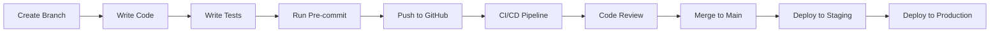

# Project Planning Document
## Legal Knowledge Base Agent - lit_law411-agent

### Executive Overview

The Legal Knowledge Base Agent is an enterprise-grade system designed to automate the acquisition, processing, and organization of legal knowledge from diverse digital sources. This document outlines the technical architecture, implementation timeline, and strategic approach for building a scalable, secure, and compliant legal information retrieval system.

### System Architecture

#### High-Level Architecture

```
┌─────────────────────────────────────────────────────────────────────┐
│                           External Sources                           │
│  ┌──────────────┐  ┌──────────────┐  ┌──────────────┐              │
│  │   YouTube    │  │   Websites   │  │   RSS Feeds  │              │
│  └──────┬───────┘  └──────┬───────┘  └──────┬───────┘              │
└─────────┼──────────────────┼──────────────────┼────────────────────┘
          │                  │                  │
          ▼                  ▼                  ▼
┌─────────────────────────────────────────────────────────────────────┐
│                        Ingestion Layer                               │
│  ┌──────────────┐  ┌──────────────┐  ┌──────────────┐              │
│  │YouTube Client│  │ Web Scraper  │  │Feed Processor│              │
│  └──────┬───────┘  └──────┬───────┘  └──────┬───────┘              │
│         │                  │                  │                      │
│         └──────────────────┴──────────────────┘                     │
│                            │                                         │
│                            ▼                                         │
│                    ┌──────────────┐                                 │
│                    │ Rate Limiter │                                 │
│                    └──────┬───────┘                                 │
└────────────────────────────┼────────────────────────────────────────┘
                             │
                             ▼
┌─────────────────────────────────────────────────────────────────────┐
│                      Processing Pipeline                             │
│  ┌─────────────┐  ┌─────────────┐  ┌─────────────┐                 │
│  │Transcription│  │   NLP/NER   │  │  Embedding  │                 │
│  │  (Whisper)  │  │   (spaCy)   │  │ Generation  │                 │
│  └──────┬──────┘  └──────┬──────┘  └──────┬──────┘                 │
│         │                 │                 │                        │
│         └─────────────────┴─────────────────┘                       │
│                           │                                          │
│                           ▼                                          │
│                   ┌───────────────┐                                 │
│                   │ Celery Queue  │                                 │
│                   │   (Redis)     │                                 │
│                   └───────┬───────┘                                 │
└───────────────────────────┼─────────────────────────────────────────┘
                            │
                            ▼
┌─────────────────────────────────────────────────────────────────────┐
│                        Storage Layer                                 │
│  ┌──────────────┐  ┌──────────────┐  ┌──────────────┐              │
│  │ PostgreSQL   │  │   Pinecone   │  │   Airtable   │              │
│  │ (Supabase)   │  │   (Vectors)  │  │ (Relations)  │              │
│  └──────────────┘  └──────────────┘  └──────────────┘              │
│                    ┌──────────────┐                                 │
│                    │Elasticsearch │                                 │
│                    │ (Full-text)  │                                 │
│                    └──────────────┘                                 │
└─────────────────────────────────────────────────────────────────────┘
                            │
                            ▼
┌─────────────────────────────────────────────────────────────────────┐
│                          API Layer                                   │
│  ┌──────────────┐  ┌──────────────┐  ┌──────────────┐              │
│  │   FastAPI    │  │   GraphQL    │  │  WebSocket   │              │
│  │   REST API   │  │   Endpoint   │  │   Updates    │              │
│  └──────────────┘  └──────────────┘  └──────────────┘              │
└─────────────────────────────────────────────────────────────────────┘
```

#### Component Details

##### 1. Ingestion Layer
- **YouTube Client**: YouTube Data API v3 integration with quota management
- **Web Scraper**: Scrapy-based scraper with robots.txt compliance
- **Feed Processor**: RSS/Atom feed parser for legal blogs and news
- **Rate Limiter**: Token bucket algorithm for API rate limiting

##### 2. Processing Pipeline
- **Transcription Service**: OpenAI Whisper for audio-to-text conversion
- **NLP Engine**: spaCy with custom legal entity recognition
- **Embedding Generator**: Sentence transformers for semantic search
- **Task Queue**: Celery with Redis backend for distributed processing

##### 3. Storage Layer (Three-Database Strategy)
- **Airtable**: Visual interface layer for human-friendly browsing, filtering, and manual data management
- **PostgreSQL (Supabase)**: ACID-compliant relational database for complex queries, data integrity, and audit trails
- **Pinecone**: Vector database for AI-powered semantic search and similarity matching
- **Redis**: Caching layer and message broker for performance optimization

##### 4. API Layer
- **FastAPI**: High-performance REST API with OpenAPI documentation
- **GraphQL**: Flexible query endpoint for complex data relationships
- **WebSocket**: Real-time updates for active searches and alerts

### Technical Stack

#### Core Technologies
```yaml
Language: Python 3.11+
Framework: FastAPI 0.104+
Task Queue: Celery 5.3+
Databases:
  - Airtable (Visual Interface Layer)
  - PostgreSQL 15+ via Supabase (Relational Data Layer)
  - Pinecone (Vector Search Layer)
  - Redis 7+ (Caching/Message Broker)
Search/ML:
  - OpenAI Whisper
  - spaCy 3.7+
  - Sentence Transformers
  - Langchain
Infrastructure:
  - Docker & Docker Compose
  - Kubernetes (production)
  - GitHub Actions (CI/CD)
Monitoring:
  - Prometheus
  - Grafana
  - Sentry
  - ELK Stack
```

#### Development Tools
```yaml
Package Management: Poetry
Code Quality:
  - Black (formatting)
  - Ruff (linting)
  - mypy (type checking)
  - pre-commit hooks
Testing:
  - pytest
  - pytest-cov
  - pytest-asyncio
  - locust (load testing)
Documentation:
  - Sphinx
  - MkDocs
  - OpenAPI/Swagger
```

### Project Timeline

#### Phase 1: Foundation
**Environment Setup**
- [ ] Initialize Git repository and project structure
- [ ] Set up Poetry and dependencies
- [ ] Configure Docker development environment
- [ ] Set up CI/CD with GitHub Actions
- [ ] Create initial database schemas

**Core Infrastructure**
- [ ] Implement configuration management
- [ ] Set up logging and monitoring
- [ ] Create base models with SQLAlchemy/Pydantic
- [ ] Implement database connection pooling
- [ ] Set up Redis for caching

**Authentication & Security**
- [ ] Implement JWT authentication
- [ ] Set up API key management
- [ ] Configure CORS and security headers
- [ ] Implement rate limiting
- [ ] Create audit logging system

**Basic Ingestion**
- [ ] YouTube API integration
- [ ] Simple web scraper prototype
- [ ] Basic transcription pipeline
- [ ] Error handling framework
- [ ] Initial unit tests

#### Phase 2: Core Features
**Advanced Ingestion**
- [ ] Implement robust web scraping with Scrapy
- [ ] Add RSS/Atom feed support
- [ ] Create content validation pipeline
- [ ] Implement retry mechanisms
- [ ] Add source credibility scoring

**Processing Pipeline**
- [ ] Integrate Whisper for transcription
- [ ] Implement legal NER with spaCy
- [ ] Create citation extraction
- [ ] Add sentiment analysis
- [ ] Build summary generation

**Storage & Search**
- [ ] Implement vector embedding generation
- [ ] Set up Pinecone integration
- [ ] Configure Elasticsearch
- [ ] Create hybrid search algorithm
- [ ] Implement search result ranking

**API Development**
- [ ] Build comprehensive REST API
- [ ] Add GraphQL endpoint
- [ ] Implement WebSocket updates
- [ ] Create API documentation
- [ ] Add SDK generation

#### Phase 3: Enhancement 
**Advanced Features**
- [ ] Legal citation parser
- [ ] Jurisdiction detection
- [ ] Multi-language support
- [ ] Advanced query DSL
- [ ] Saved search functionality

**Performance Optimization**
- [ ] Database query optimization
- [ ] Implement connection pooling
- [ ] Add response caching
- [ ] Optimize embedding generation
- [ ] Load balancing setup

**Admin & Analytics**
- [ ] Build admin dashboard
- [ ] Add usage analytics
- [ ] Create reporting system
- [ ] Implement user management
- [ ] Add billing integration

**Testing & Documentation**
- [ ] Comprehensive integration tests
- [ ] Load and stress testing
- [ ] Security penetration testing
- [ ] API documentation
- [ ] User guides and tutorials

#### Phase 4: Production Ready 
**Security Hardening**
- [ ] Security audit
- [ ] Implement WAF rules
- [ ] Configure DDoS protection
- [ ] Set up VPN access
- [ ] Encrypt sensitive data

**Deployment Preparation**
- [ ] Kubernetes configuration
- [ ] Set up monitoring alerts
- [ ] Configure auto-scaling
- [ ] Database migration scripts
- [ ] Disaster recovery setup

**Production Deployment**
- [ ] Deploy to staging
- [ ] Run acceptance tests
- [ ] Deploy to production
- [ ] Monitor performance
- [ ] Address initial issues

**Post-Launch**
- [ ] User training sessions
- [ ] Gather feedback
- [ ] Performance tuning
- [ ] Plan next iterations
- [ ] Celebrate launch! 🎉

### Resource Allocation

#### Team Structure
```yaml
Project Lead: 1
Backend Engineers: 3
ML/NLP Engineer: 1
DevOps Engineer: 1
QA Engineer: 1
Technical Writer: 1 (part-time)
Legal Advisor: 1 (consultant)
```

#### Infrastructure Costs (Monthly Estimate)
```yaml
Cloud Infrastructure:
  - Compute (Kubernetes): $500-1000
  - Storage (100TB): $2000
  - CDN/Bandwidth: $300
  
APIs & Services:
  - YouTube API: Free (with quotas)
  - OpenAI (Whisper): $500
  - Pinecone: $70-500
  - Supabase: $25-500
  - Elasticsearch: $95-500
  
Monitoring & Tools:
  - Sentry: $26
  - GitHub: $21
  - Other tools: $100
  
Total: ~$3,500-5,500/month
```

### Risk Management

#### Technical Risks
| Risk | Impact | Mitigation |
|------|--------|------------|
| API Rate Limits | High | Implement caching, request pooling, multiple API keys |
| Scalability Issues | High | Design for horizontal scaling, use message queues |
| Data Quality | Medium | Validation pipelines, manual review processes |
| Security Breach | Critical | Regular audits, encryption, access controls |
| Cost Overruns | High | Usage monitoring, cost alerts, optimization |

#### Legal & Compliance Risks
| Risk | Impact | Mitigation |
|------|--------|------------|
| Copyright Infringement | Critical | Legal review, fair use compliance, attribution |
| Privacy Violations | High | GDPR/CCPA compliance, data anonymization |
| Terms of Service | Medium | Regular ToS review, compliance monitoring |
| Jurisdiction Issues | Medium | Geo-fencing, jurisdiction-specific rules |

### Quality Assurance

#### Code Quality Standards
- **Test Coverage**: Minimum 80% coverage
- **Code Review**: All PRs require 2 approvals
- **Documentation**: All public APIs must be documented
- **Performance**: All endpoints < 500ms response time
- **Security**: OWASP Top 10 compliance

#### Testing Strategy
```yaml
Unit Tests:
  - pytest for all business logic
  - Mock external dependencies
  - Test edge cases
  
Integration Tests:
  - Test API endpoints
  - Database operations
  - External service integration
  
E2E Tests:
  - User journey tests
  - Cross-browser testing
  - Performance benchmarks
  
Load Tests:
  - 10,000 concurrent users
  - 1M requests/day
  - Stress test scenarios
```

### Monitoring & Observability

#### Key Metrics
```yaml
System Metrics:
  - CPU/Memory usage
  - Disk I/O
  - Network throughput
  - Queue depth
  
Application Metrics:
  - Request rate
  - Response time
  - Error rate
  - Success rate
  
Business Metrics:
  - Documents processed/day
  - Search queries/day
  - User engagement
  - Data quality score
```

#### Alerting Rules
- **Critical**: System down, data loss risk
- **High**: Performance degradation, high error rate
- **Medium**: Approaching quotas, unusual activity
- **Low**: Scheduled maintenance, minor issues

### Success Criteria

#### Technical KPIs
- 99.9% uptime SLA
- < 500ms search response time
- 95%+ transcription accuracy
- 80%+ test coverage
- Zero critical security vulnerabilities

#### Business KPIs
- 1,000+ active users in initial deployment
- 100,000+ documents processed
- 50,000+ searches/month
- 85%+ user satisfaction
- 20% month-over-month growth

### Next Steps

1. **Immediate Actions** (Now)
   - Set up development environment
   - Create project repository structure
   - Initialize Poetry project
   - Set up pre-commit hooks
   - Create initial CI/CD pipeline

2. **Short Term** (Phase 1 Completion)
   - Complete technical design documents
   - Set up development databases
   - Create API contracts
   - Begin Sprint 1 development
   - Onboard team members

3. **Long Term** (Ongoing)
   - Complete Phase 1 deliverables
   - Conduct first demo
   - Gather stakeholder feedback
   - Refine requirements
   - Plan Phase 2 sprints

### Appendices

#### A. Database Schema (Simplified)
```sql
-- Core tables
sources (id, type, name, url, credibility_score)
content (id, source_id, type, title, url, created_at)
transcripts (id, content_id, text, language, confidence)
embeddings (id, content_id, vector, model_version)
entities (id, content_id, type, name, metadata)
users (id, email, role, created_at)
searches (id, user_id, query, results, created_at)
```

#### B. API Endpoints (Sample)
```yaml
# Content Management
POST   /api/v1/sources
GET    /api/v1/content
POST   /api/v1/content/ingest

# Search
POST   /api/v1/search
GET    /api/v1/search/suggestions
POST   /api/v1/search/save

# Admin
GET    /api/v1/admin/stats
POST   /api/v1/admin/users
GET    /api/v1/admin/logs
```

#### C. Development Workflow
